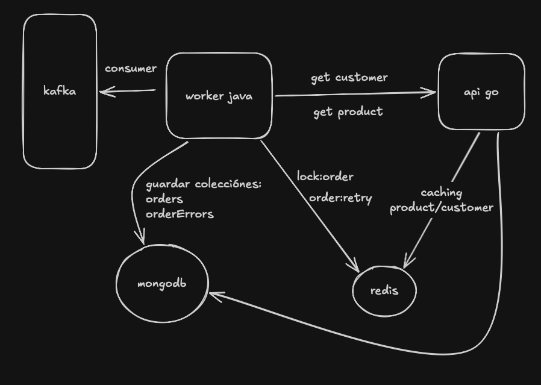

*🧪 Prueba Técnica: Worker Java y Go para Procesamiento de Pedidos con Enriquecimiento de Datos y Resiliencia**

Para simular el entorno de esta prueba técnica, se proporciona un archivo `docker-compose.yml` que levanta automáticamente los siguientes servicios:

- **Kafka** – Broker de mensajería para la comunicación entre servicios.
- **Redis** – Sistema de caché.
- **MongoDB** – Base de datos para persistencia.
- **Herramientas gráficas** para inspeccionar datos.
- **API en Go** – Servicio utilizado para el enriquecimiento de datos.
---

## 🚀 Levantar el entorno

Desde la **carpeta raíz del proyecto**, ejecutar el siguiente comando:

```bash
docker compose up -d
```
---

## Producir mensajes en topic order
Con el contenedor kafka iniciado, ejecutar el siguiente comando en terminal
``` bash
docker exec -it kafka_container bash
```
Luego utilizar kafka-console-producer con el siguiente comando
``` bash
kafka-console-producer --topic order --bootstrap-server localhost:9092
```
Esto abrira una linea donde puedes escribir mensajes, en este caso enviar el siguiente json en una sola línea:
``` bash
{"orderId":"order-1234","customerId":"69b0df7ccfb808f94a8563b1","products":["69b0df7ccfb808f94a8563b4","69b0df7ccfb808f94a8563b5"]}
```
---
Iniciar el worker en el IDE de su preferencia, asi procesara este mensaje y hara su respectivo flujo de validaciones y registro de datos.

Ingresa a http://localhost:8081 es la interfaz grafica de mongodb para revisar las colecciones en la base de datos company, con las siguientes credenciales
-   usuario: admin
-   clave: pass
---

## Endpoints api go
obtener producto:
``` bash
curl --request GET \
  --url http://localhost:8000/api/v1/products/69b0df7ccfb808f94a8563b4 
```
obtener cliente:
``` bash
curl --request GET \
  --url http://localhost:8000/api/v1/customers/69b0df7ccfb808f94a8563b1
```
---

### Flujo del sistema

